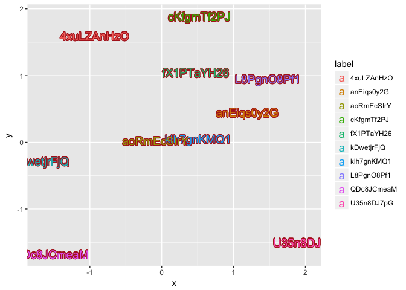

<!-- README.md is generated from README.Rmd. Please edit that file -->
``` r
library(ggplot2)
library(ggshadow)
random_text <- function(n=1, length=1) {
    d <- data.frame(n=1:n, length=length)
    sapply(1:nrow(d), function(i) {
        paste(sample(c(0:9, letters, LETTERS),
                     d$length[i], replace=TRUE),
              collapse="")
    })
}

n <- 10
set.seed(2017-10-27)
d <- data.frame(x = rnorm(n), y=rnorm(n),
                label = random_text(n, 10))
ggplot(d, aes(x,y)) + geom_shadowtext(aes(label=label), size=5)
```


``` r
ggplot(d, aes(x,y)) + geom_shadowtext(aes(label=label, color=label), bgcolor='firebrick', size=5)
```


