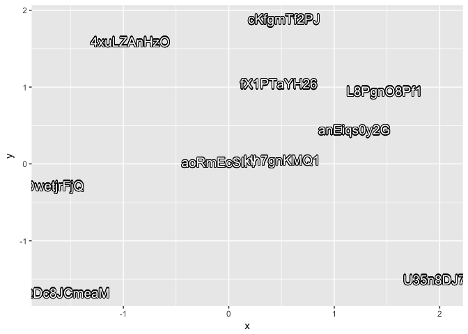
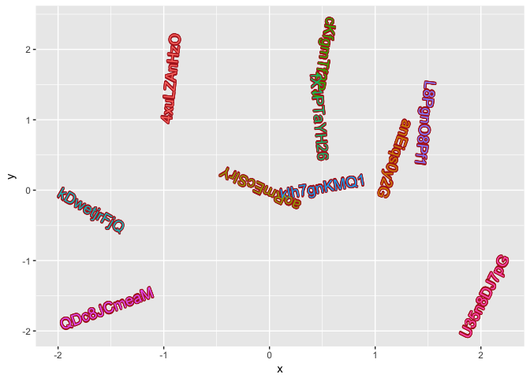

<!-- README.md is generated from README.Rmd. Please edit that file -->
shadow text grob: `shadowtextGrob` and `grid.shadowtext`
--------------------------------------------------------

``` r
library(shadowtext)
grid.shadowtext("hello world", gp=gpar(cex=8, col="steelblue"), bg.color="firebrick")
```


ggplot2 layer: `geom_shadowtext`
--------------------------------

``` r
library(ggplot2)

random_text <- function(n=1, length=10) {
    d <- data.frame(n=1:n, length=length)
    sapply(1:nrow(d), function(i) {
        paste(sample(c(0:9, letters, LETTERS),
                     d$length[i], replace=TRUE),
              collapse="")
    })
}

n <- 10
set.seed(2017-10-27)
d <- data.frame(x = rnorm(n), y=rnorm(n),
                label = random_text(n))
ggplot(d, aes(x,y)) + geom_shadowtext(aes(label=label), size=5)
```



``` r
ggplot(d, aes(x,y)) + geom_shadowtext(aes(label=label, color=label), bg.color='firebrick', size=5)
```


